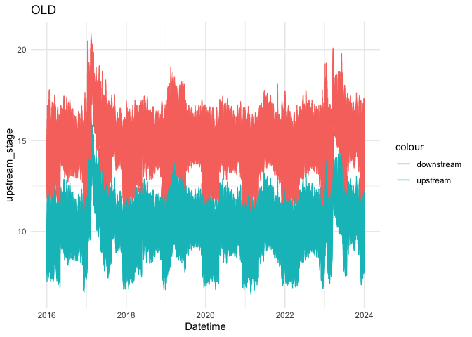
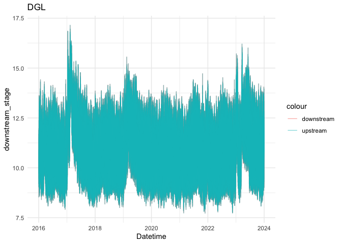
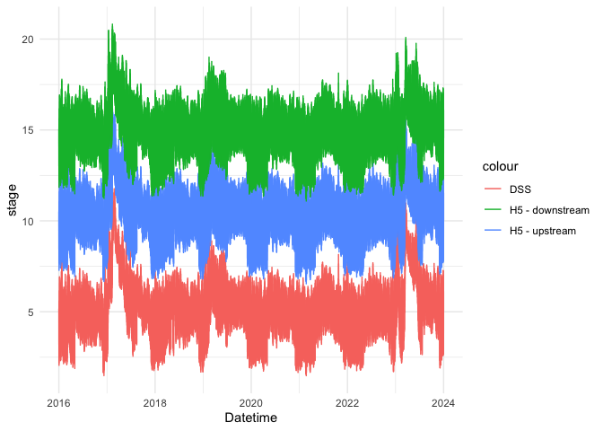

H5 Stage Export Exploration
================
Maddee Rubenson (FlowWest)
2025-02-21

### Objective

Compare scenario `FPV2Mb` to baseline `H1Z` daily summary values. Note
that data was exported from the H5 here:
<https://github.com/FlowWest/sdg-dashboard/tree/hydro-exports>

### Load H5 exports

``` r
old_stage_export <- read_csv('data-raw/hdf5_exports/old_stage_export.csv') |> 
  select(-`...1`) |> 
  glimpse()
```

    ## New names:
    ## Rows: 841537 Columns: 6
    ## ── Column specification
    ## ──────────────────────────────────────────────────────── Delimiter: "," chr
    ## (1): channel_name dbl (4): ...1, upstream_stage, downstream_stage, channel_id
    ## dttm (1): Datetime
    ## ℹ Use `spec()` to retrieve the full column specification for this data. ℹ
    ## Specify the column types or set `show_col_types = FALSE` to quiet this message.
    ## • `` -> `...1`

    ## Rows: 841,537
    ## Columns: 5
    ## $ upstream_stage   <dbl> 10.432000, 10.432203, 10.435493, 10.449473, 10.476360…
    ## $ downstream_stage <dbl> 15.00800, 15.00782, 15.00829, 15.01230, 15.02278, 15.…
    ## $ Datetime         <dttm> 2016-01-01 00:00:00, 2016-01-01 00:05:00, 2016-01-01…
    ## $ channel_id       <dbl> 71, 71, 71, 71, 71, 71, 71, 71, 71, 71, 71, 71, 71, 7…
    ## $ channel_name     <chr> "OLD", "OLD", "OLD", "OLD", "OLD", "OLD", "OLD", "OLD…

``` r
dgl_stage_export <- read_csv('data-raw/hdf5_exports/dgl_stage_export.csv') |> 
  select(-`...1`) |> 
  glimpse()
```

    ## New names:
    ## Rows: 841537 Columns: 6
    ## ── Column specification
    ## ──────────────────────────────────────────────────────── Delimiter: "," chr
    ## (1): channel_name dbl (4): ...1, upstream_stage, downstream_stage, channel_id
    ## dttm (1): Datetime
    ## ℹ Use `spec()` to retrieve the full column specification for this data. ℹ
    ## Specify the column types or set `show_col_types = FALSE` to quiet this message.
    ## • `` -> `...1`

    ## Rows: 841,537
    ## Columns: 5
    ## $ upstream_stage   <dbl> 11.70000, 11.69154, 11.61403, 11.34781, 11.02404, 10.…
    ## $ downstream_stage <dbl> 11.70300, 11.69851, 11.65199, 11.46317, 11.12438, 10.…
    ## $ Datetime         <dttm> 2016-01-01 00:00:00, 2016-01-01 00:05:00, 2016-01-01…
    ## $ channel_id       <dbl> 205, 205, 205, 205, 205, 205, 205, 205, 205, 205, 205…
    ## $ channel_name     <chr> "DGL", "DGL", "DGL", "DGL", "DGL", "DGL", "DGL", "DGL…

``` r
mho_stage_export <- read_csv('data-raw/hdf5_exports/mho_stage_export.csv') |> 
  select(-`...1`) |> 
  glimpse()
```

    ## New names:
    ## Rows: 841537 Columns: 6
    ## ── Column specification
    ## ──────────────────────────────────────────────────────── Delimiter: "," chr
    ## (1): channel_name dbl (4): ...1, upstream_stage, downstream_stage, channel_id
    ## dttm (1): Datetime
    ## ℹ Use `spec()` to retrieve the full column specification for this data. ℹ
    ## Specify the column types or set `show_col_types = FALSE` to quiet this message.
    ## • `` -> `...1`

    ## Rows: 841,537
    ## Columns: 5
    ## $ upstream_stage   <dbl> 19.90700, 19.90658, 19.90628, 19.90584, 19.90514, 19.…
    ## $ downstream_stage <dbl> 25.16381, 25.16358, 25.16319, 25.16286, 25.16223, 25.…
    ## $ Datetime         <dttm> 2016-01-01 00:00:00, 2016-01-01 00:05:00, 2016-01-01…
    ## $ channel_id       <dbl> 128, 128, 128, 128, 128, 128, 128, 128, 128, 128, 128…
    ## $ channel_name     <chr> "MHO", "MHO", "MHO", "MHO", "MHO", "MHO", "MHO", "MHO…

``` r
old_stage_export |> 
  ggplot() +
  geom_line(aes(x = Datetime, y = upstream_stage, color = "upstream")) +
  geom_line(aes(x = Datetime, y = downstream_stage, color = "downstream")) +
  theme_minimal() +
  ggtitle('OLD')
```

<!-- -->

``` r
dgl_stage_export |> 
  ggplot() +
  geom_line(aes(x = Datetime, y = downstream_stage, color = "downstream"), alpha = 0.5) +
  geom_line(aes(x = Datetime, y = upstream_stage, color = "upstream"), alpha = 0.5) +
  theme_minimal() + 
  ggtitle('DGL')
```

<!-- -->

``` r
mho_stage_export |> 
  ggplot() +
  geom_line(aes(x = Datetime, y = upstream_stage, color = "upstream")) +
  geom_line(aes(x = Datetime, y = downstream_stage, color = "downstream")) +
  theme_minimal() +
  ggtitle('MHO')
```

<!-- -->
\#### OLD Comparison to DSS Export

``` r
ggplot() + 
  geom_line(data = old_dss_export, aes(x = Datetime, y = dss_stage_feet, color = "DSS")) +
  geom_line(data = old_stage_export, aes(x = Datetime, y = upstream_stage, color = "H5 - upstream")) +
  geom_line(data = old_stage_export, aes(x = Datetime, y = downstream_stage, color = "H5 - downstream")) +
  theme_minimal() +
  ylab('stage')
```

<!-- -->
\## Get Stage Summaries

``` r
old_stage_export |> 
  full_join(dgl_stage_export) |> 
  full_join(mho_stage_export) |> 
  janitor::clean_names() |> 
  mutate(date = as.Date(datetime)) |> 
  group_by(date, channel_name, channel_id) |> 
  summarise(daily_avg = mean(c(upstream_stage, downstream_stage)),
            daily_min = min(c(upstream_stage, downstream_stage)),
            daily_max = max(c(upstream_stage, downstream_stage))) |> glimpse()
```

    ## Joining with `by = join_by(upstream_stage, downstream_stage, Datetime,
    ## channel_id, channel_name)`
    ## Joining with `by = join_by(upstream_stage, downstream_stage, Datetime,
    ## channel_id, channel_name)`
    ## `summarise()` has grouped output by 'date', 'channel_name'. You can override
    ## using the `.groups` argument.

    ## Rows: 8,769
    ## Columns: 6
    ## Groups: date, channel_name [8,769]
    ## $ date         <date> 2016-01-01, 2016-01-01, 2016-01-01, 2016-01-02, 2016-01-…
    ## $ channel_name <chr> "DGL", "MHO", "OLD", "DGL", "MHO", "OLD", "DGL", "MHO", "…
    ## $ channel_id   <dbl> 205, 128, 71, 205, 128, 71, 205, 128, 71, 205, 128, 71, 2…
    ## $ daily_avg    <dbl> 10.58746, 21.56822, 11.57969, 10.08187, 21.03369, 11.0748…
    ## $ daily_min    <dbl> 9.199502, 17.520332, 7.921581, 8.531534, 16.840263, 7.277…
    ## $ daily_max    <dbl> 11.89215, 25.58471, 15.13400, 11.97314, 25.62956, 15.1508…

``` r
# summarize to daily min, max, mean 
# compare to HZ1 baseline file 
```

### Compare to Baseline

``` r
knitr::knit_exit()
```
